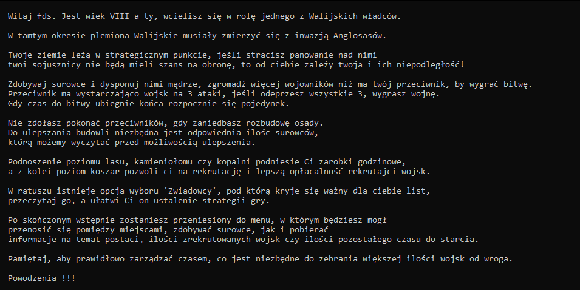
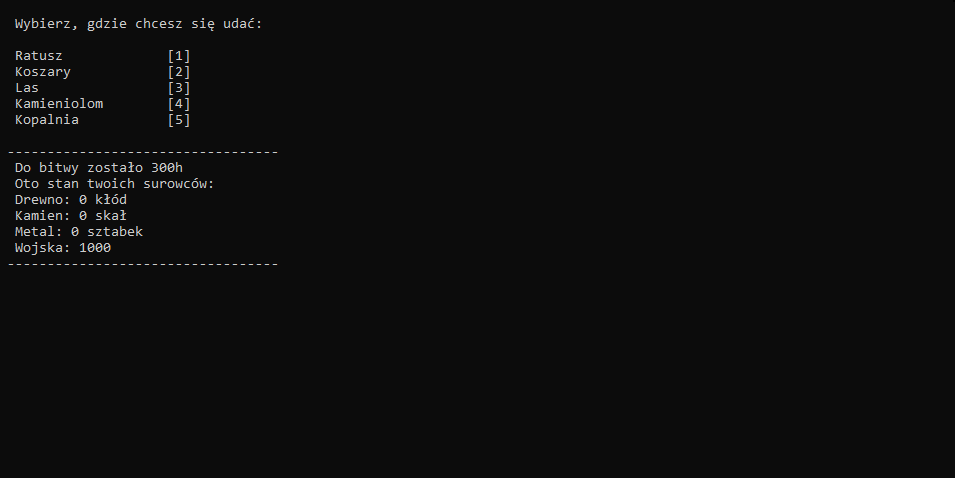
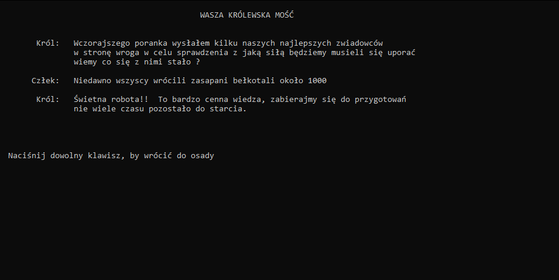

# KsiazeGwynned
KsiazyGwynned to gra strategiczna (ekonomiczna).\
Zgromadz odpowiedznia ilośc wojsk, aby odeprzeć ataki wroga.

## General Information

Gracze zaczyna w osadzie i może udać się do jednego z pięciu miejsc:
* Ratusz: Służy do ulepszania budowli
* Koszary: Służy do rekrutowania jednostek
* Tartak: Służy do wydobywania drewna
* Kamieniołom: Służy do wydobywania kamienia
* Kopalnia: Służy do wydobywania metalu

Celem gry jest obrona przed przeciwnikiem(komputer),który zaatakuje kilku krotnie po upływie określonego czasu.

Gracz operuję trzema rodzajami surowców:
* Drewno
* Kamień 
* Metal
 
Za pomocą, których może rekrutować wojska oraz ulepszać budowle.

## Technology 
 Aplikacja napisana w programie:
* Visual Studio 2019

 Język programowania:
* C++
## Screenshots

## Setup
 W celu uruchomienia aplikacji należy uruchomić plik "KsiazeGwynned.exe",  
 lub uruchomić plik "KsiazeGwynned.sln" i uruchomienie z poziomu programu Visual Studio 2019.
 
## Usage
 Program został stworzony jednynie w celu rozrowykowym.  
 
## Authors
* https://github.com/SebastianHarasim
* https://github.com/DominikGwizdala
* https://github.com/akuchta

